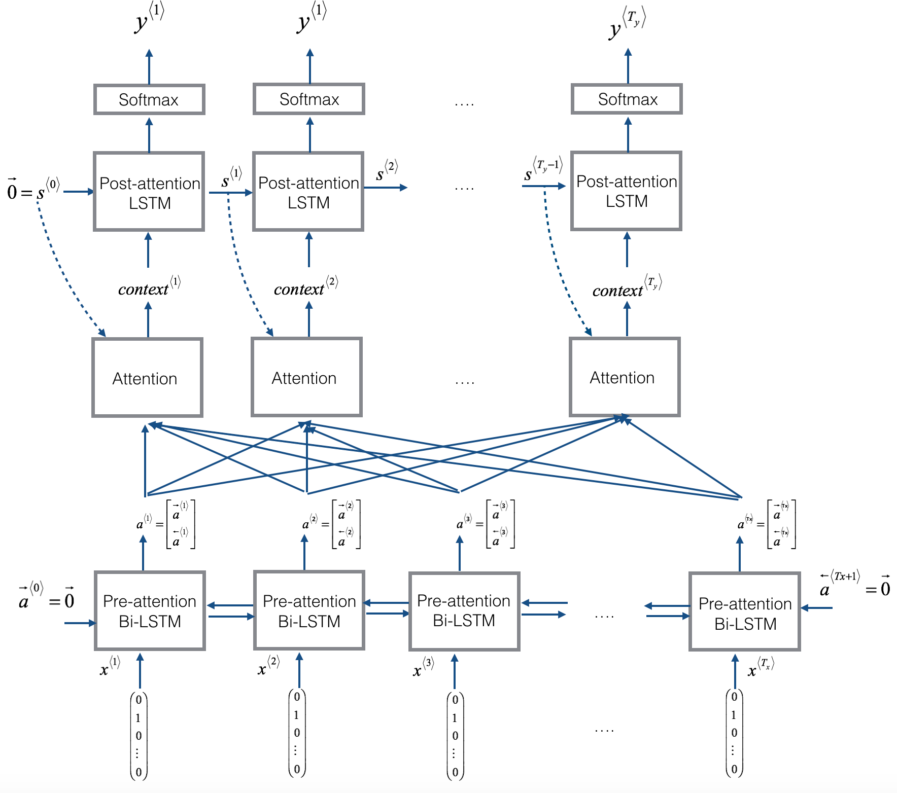
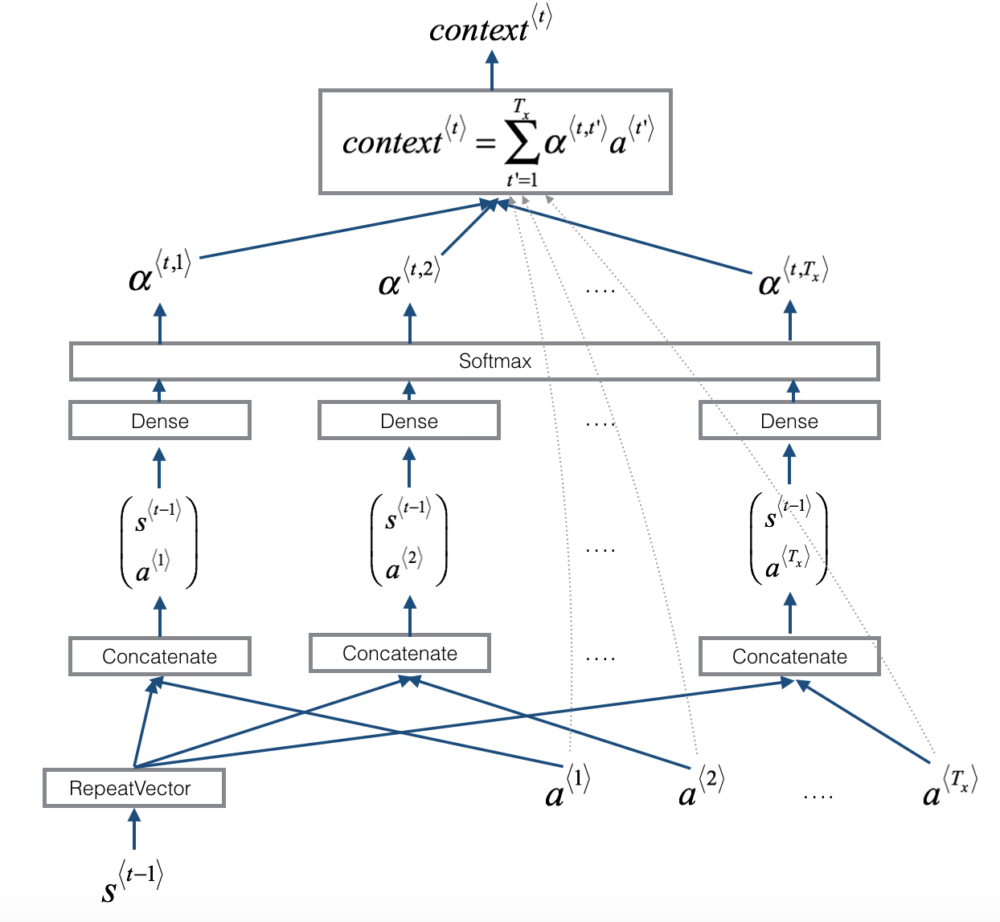
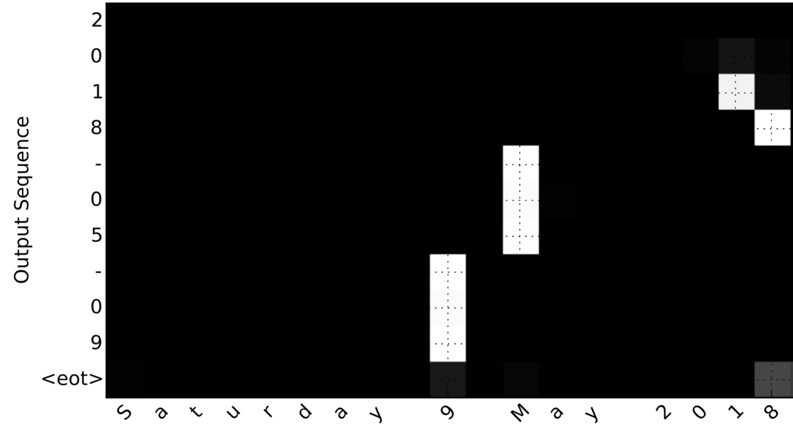

# Neural Machine Translation with Attention

This project implements a simplified Neural Machine Translation model using an attention-based sequence-to-sequence architecture. The model learns to convert human-readable date expressions into a standardized machine-readable format.

For example, the model translates inputs such as:

```text
3 May 1979
5 April 09
Tue 10 Jul 2007
Saturday May 9 2018
```

into the target format:

```text
YYYY-MM-DD
```

## Project Overview

The goal of this project is to demonstrate how attention mechanisms can improve sequence-to-sequence learning by allowing a decoder to focus on the most relevant parts of an input sequence while generating each output character.

Instead of translating between two natural languages, this project uses date translation as a controlled Neural Machine Translation task. The input is a date written in different human-readable formats, and the output is a standardized machine-readable date.

Example mappings:

```text
the 29th of August 1958  ->  1958-08-29
03/30/1968              ->  1968-03-30
24 JUNE 1987            ->  1987-06-24
```

## Neural Machine Translation with Attention

The model uses an encoder-decoder architecture with attention. The encoder reads the input date sequence, while the decoder generates the standardized output date one character at a time.

<p align="center">
  
</p>

## Attention Mechanism

The attention mechanism allows the model to focus on different parts of the input sequence while generating each output character.

At each output timestep, the model:

1. Looks at the encoder hidden states
2. Compares them with the previous decoder hidden state
3. Computes attention weights
4. Builds a context vector
5. Uses that context vector to predict the next output character

<p align="center">
  
</p>

## Key Features

* Built a sequence-to-sequence Neural Machine Translation model
* Implemented an attention mechanism from scratch using Keras layers
* Used a Bidirectional LSTM encoder to process input date sequences
* Used a post-attention LSTM decoder to generate output dates
* Converted raw text dates into indexed and one-hot encoded representations
* Trained the model on 10,000 human-readable date examples
* Loaded pre-trained weights for prediction and evaluation
* Visualized attention weights to interpret what the model focuses on during translation

## Dataset

The dataset contains 10,000 examples of human-readable dates paired with their machine-readable equivalents.

Each input date can appear in different natural formats, such as:

```text
9 may 1998
10.11.19
friday october 24 2025
saturday april 28 1990
```

Each target output follows the fixed format:

```text
YYYY-MM-DD
```

The task is useful for understanding sequence modeling because the model must learn how to identify the year, month, and day from different positions in the input text.

## Model Architecture

The model follows an encoder-decoder architecture with attention.

### Encoder

The encoder uses a Bidirectional LSTM to process the input sequence. This allows each character representation to include information from both the forward and backward directions of the input.

### Attention Layer

The attention layer computes attention weights over the input sequence for each output timestep. These weights determine which input characters are most relevant for predicting the current output character.

### Decoder

The decoder uses a post-attention LSTM. For each output timestep, it receives the context vector from the attention mechanism and predicts the next character in the machine-readable date.

The output sequence has a fixed length of 10 characters:

```text
YYYY-MM-DD
```

## Model Summary

The model uses:

* Input sequence length: `Tx = 30`
* Output sequence length: `Ty = 10`
* Pre-attention Bi-LSTM hidden units: `n_a = 32`
* Post-attention LSTM hidden units: `n_s = 64`
* Total trainable parameters: `52,960`

## Example Predictions

After loading trained model weights, the model was tested on new date examples.

```text
source: 5 April 09
output: 2009-04-05

source: Tue 10 Jul 2007
output: 2007-07-10

source: Saturday May 9 2018
output: 2018-05-09

source: March 3rd 2001
output: 2001-03-03

source: 1 March 2001
output: 2001-03-01
```

Some predictions may still contain errors, which shows that the model is a learning implementation rather than a fully production-ready date parser.

## Attention Visualization

The notebook includes attention visualization to show how the model focuses on different parts of the input sequence while generating each output character.

For example, when converting:

```text
Saturday 9 May 2018 -> 2018-05-09
```

the attention map helps show how the model attends to the year, month, and day while ignoring less important text such as the weekday.

<p align="center">
  
</p>

## Technologies Used

* Python
* TensorFlow
* Keras
* NumPy
* Matplotlib
* Faker
* Babel
* tqdm
* Jupyter Notebook / Google Colab

## Project Structure

```text
neural_machine_translation_with_attention/
│
├── neural_machine_translation_with_attention/
│   ├── Neural_machine_translation_with_attention_v4a.ipynb
│   └── images/
│       ├── attn_model.png
│       ├── attn_mechanism.png
│       └── date_attention.png
│
└── README.md
```

## How to Run

Clone the repository:

```bash
git clone https://github.com/Raphlawren/neural_machine_translation_with_attention.git
cd neural_machine_translation_with_attention
```

Open the notebook:

```bash
jupyter notebook neural_machine_translation_with_attention/Neural_machine_translation_with_attention_v4a.ipynb
```

Or upload the notebook to Google Colab and run it there.

## Notes

This project is mainly intended as a deep learning learning project. It demonstrates core ideas behind Neural Machine Translation, attention mechanisms, sequence preprocessing, encoder-decoder modeling, and model interpretability through attention visualization.

